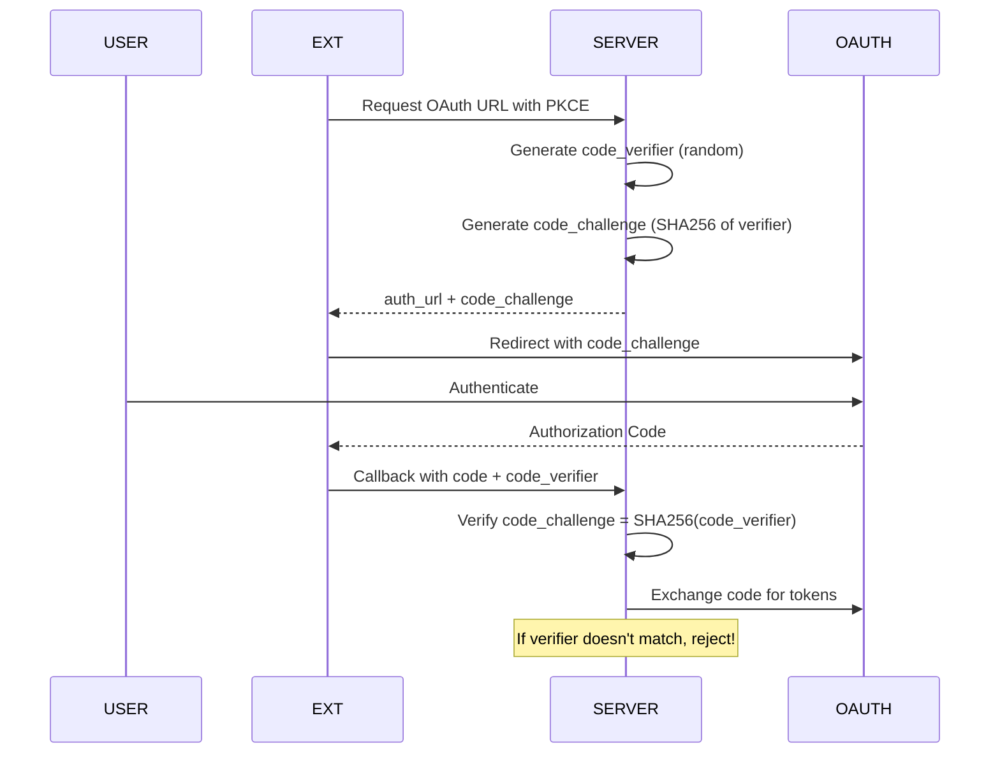

# OAuth Hardening - Enterprise Security Implementation

## Overview

The AI Email Organizer implements comprehensive OAuth security hardening with PKCE, nonce validation, replay prevention, token rotation, and secure session management.

## OAuth Security Features

### 1. PKCE (Proof Key for Code Exchange)

PKCE prevents authorization code interception attacks:



### Implementation

```python
# PKCE pair generation
def generate_pkce_pair():
    # 32 bytes of random data for verifier
    verifier = base64.urlsafe_b64encode(secrets.token_bytes(32)).decode()
    verifier = verifier.rstrip('=')
    
    # S256 challenge
    challenge = base64.urlsafe_b64encode(
        hashlib.sha256(verifier.encode()).digest()
    ).decode().rstrip('=')
    
    return PKCEPair(verifier=verifier, challenge=challenge, method="S256")
```

### 2. Nonce Validation

Prevents replay attacks using one-time tokens:

```python
# Generate cryptographically secure nonce
def generate_nonce():
    return base64.urlsafe_b64encode(secrets.token_bytes(32)).decode().rstrip('=')

# Validate nonce in callback
def validate_nonce(session_nonce: str, callback_nonce: str) -> bool:
    if not session_nonce or not callback_nonce:
        return False
    return constant_time_compare(session_nonce, callback_nonce)
```

### 3. Callback Replay Prevention

Authorization codes are one-time use:

```python
# Track used auth codes
_used_auth_codes: Dict[str, float] = {}

def validate_callback(code: str, state: str) -> bool:
    code_hash = hashlib.sha256(code.encode()).hexdigest()
    
    if code_hash in _used_auth_codes:
        # Duplicate - reject!
        logger.warning("Duplicate auth code detected")
        return False
    
    # Mark as used
    _used_auth_codes[code_hash] = time.time()
    return True
```

### 4. Callback Expiration

Callbacks expire after a time window (default: 10 minutes):

```python
SESSION_TIMEOUT = 600  # 10 minutes

def validate_callback_timestamp(created_at: float) -> bool:
    if time.time() - created_at > SESSION_TIMEOUT:
        logger.warning("OAuth session expired")
        return False
    return True
```

### 5. State Token Lifecycle

State tokens prevent CSRF attacks:

```python
# Generate state parameter
def generate_state():
    return secrets.token_urlsafe(32)

# Validate state matches session
def validate_state(session_state: str, callback_state: str) -> bool:
    return constant_time_compare(session_state, callback_state)
```

### 6. Token Rotation

Automatic token refresh before expiration:

```python
# Token family for rotation tracking
@dataclass
class TokenFamily:
    family_id: str
    active_token_id: str
    previous_token_id: Optional[str]
    rotation_count: int = 0
    status: str = "active"  # active, rotating, revoked

# Rotate tokens automatically
async def refresh_token(family_id: str) -> str:
    family = token_families[family_id]
    
    # Store previous token
    family.previous_token_id = family.active_token_id
    
    # Get new token from provider
    new_token = await provider.refresh_token(family.active_token_id)
    
    # Update active token
    family.active_token_id = new_token
    family.rotation_count += 1
    
    return new_token
```

### 7. Token Revocation Detection

Monitor for token invalidation:

```python
async def detect_token_revoked(refresh_response) -> bool:
    if refresh_response.status == 401:
        # Token revoked or expired
        await invalidate_token_family(family_id)
        return True
    return False
```

## Security Configuration

### Session Isolation

```python
SESSION_CONFIG = {
    "timeout": 3600,           # 1 hour
    "cookie_secure": True,     # HTTPS only
    "cookie_httponly": True,   # No JS access
    "cookie_samesite": "strict",
    "fingerprint_validation": True
}
```

### Correlation IDs

Track requests through the system:

```python
# Generate correlation ID
correlation_id = str(uuid.uuid4())

# Include in all logging and tracing
logger.info(f"[{correlation_id}] OAuth flow started", extra={"correlation_id": correlation_id})
```

## Localhost-Only Security

### CRITICAL: Server Binding

**ALWAYS**: `127.0.0.1:4597`

**NEVER**: `0.0.0.0`

```python
# Correct configuration
SERVER_CONFIG = {
    "host": "127.0.0.1",  # localhost only!
    "port": 4597,
    "allowed_origins": ["http://127.0.0.1:4597"]
}

# SECURITY VIOLATION - DO NOT USE
# host: "0.0.0.0"  # Exposes to external network!
```

## OAuth Flow Documentation

### Gmail OAuth Flow

1. **Start**: Client requests OAuth URL
2. **Generate**: Server creates PKCE verifier/challenge + nonce + state
3. **Redirect**: Client redirected to Google
4. **Authenticate**: User enters credentials
5. **Callback**: Authorization code returned to localhost
6. **Exchange**: Server exchanges code for tokens (with PKCE verification)
7. **Store**: Tokens encrypted and stored with family ID
8. **Refresh**: Automatic refresh before expiration

### Outlook OAuth Flow

Same as Gmail with Microsoft OAuth 2.0 endpoint differences:
- Authorization URL: `https://login.microsoftonline.com/common/oauth2/v2.0/authorize`
- Token URL: `https://login.microsoftonline.com/common/oauth2/v2.0/token`

## Related Documentation

- [Security Zones](security/ZONES.md)
- [Extension Security](extension/README.md)
- [Token Vault](security/VAULT.md)
- [Troubleshooting - OAuth](troubleshooting/OAUTH.md)